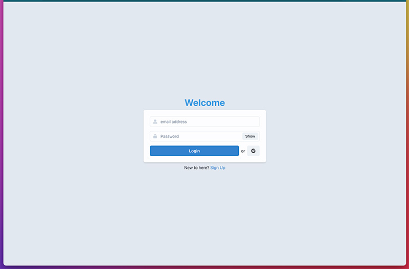
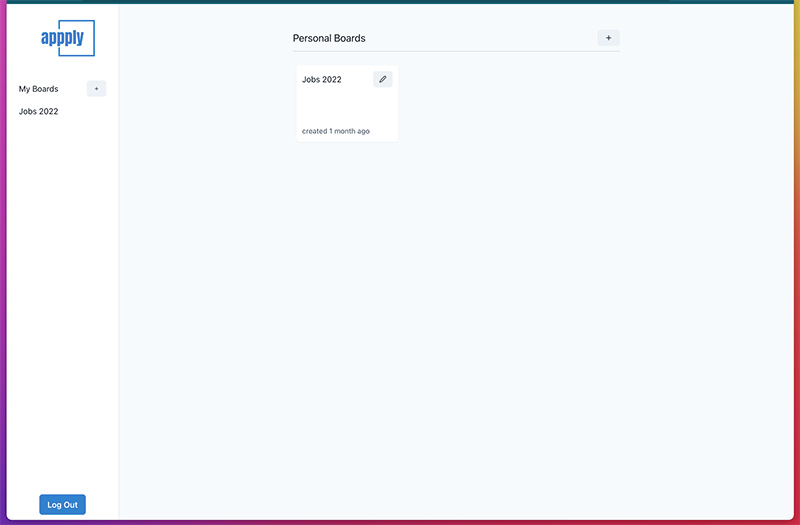
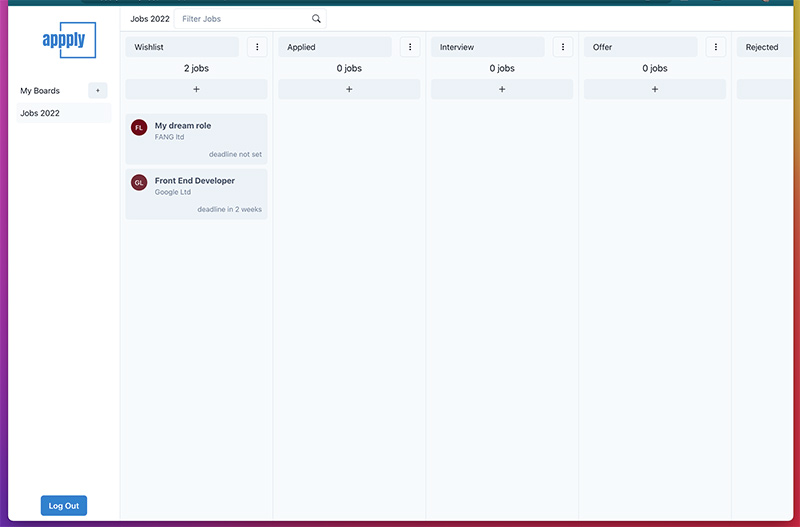
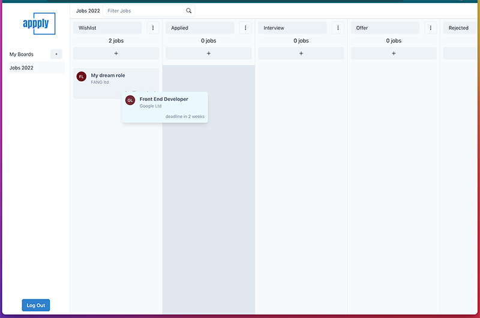
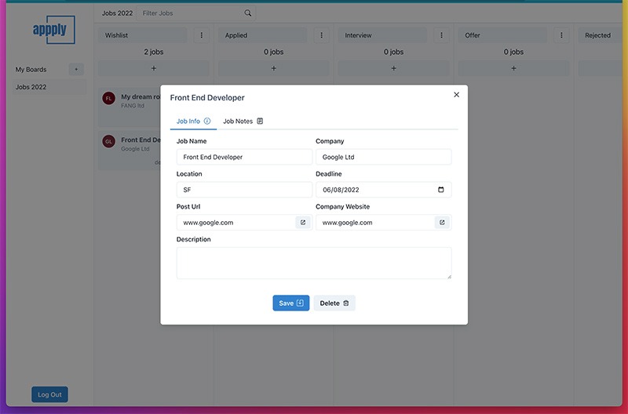

##APPPLY
Trello-like job tracking tool

User stories:

- User can register with email/password or google account
- User can create boards
- User can create Jobs in each board
- User can move Jobs around predefined lists (wish list, applied, interviewed, offer, etc...)
- User can edit each Job with necessary data
- User can filter Jobs inside board
- User can edit list names, add new lists or delete existing

TODOs:

- Add option to choose a color for a Job to easily distinguish from the rest
- Add overview of Jobs that are about to expire

Tech stack:

- TypeScript
- React
- Firebase
- React Router v6
- Chakra UI
- React Beautiful DND
- Javascript Time Ago
- TipTap (rich text editor)

[DEMO](https://appply.netlify.app)

###Screenshots

1. Login
   

2. Boards
   

3. Board
   

4. Drag And Drop
   

5. Job
   
